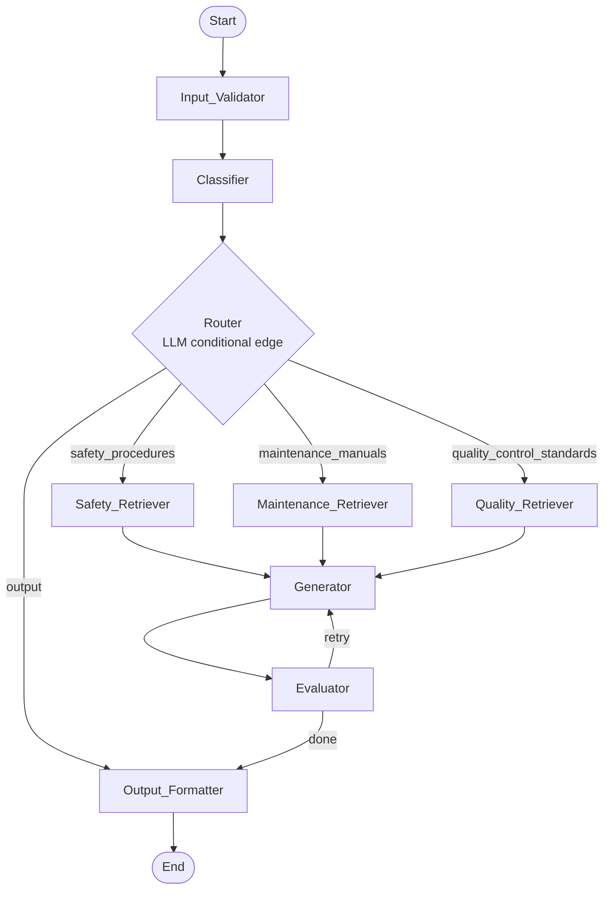

# Design Document: LangGraph RAG Pipeline

## Overview

The LangGraph RAG Pipeline is an agentic retrieval-augmented generation system for plant floor supervisors. It accepts a natural language query, routes it to the correct documentation domain, retrieves relevant chunks via hybrid search, generates a grounded answer, evaluates answer quality, and returns a structured response with citations and a full reasoning trace.

The pipeline is implemented as a LangGraph `StateGraph` where each processing step is a node that reads from and writes to a shared `PipelineState` (Pydantic v2). A `short_circuit` flag propagates early-exit conditions (invalid input, unknown category, no results) cleanly through the graph without branching every edge.

### Key Design Goals

- Grounded answers: the Generator is explicitly instructed to answer only from retrieved context
- Explainability: every node appends its decision to `reasoning_trace`
- Resilience: a single retry loop (Evaluator → Generator) handles low-quality answers
- Testability: pure-function nodes with deterministic inputs make unit and property testing straightforward
- Configurability: all runtime parameters live in a single `Settings` object loaded from environment variables

---

## Architecture



### Short-Circuit Propagation

Any node that detects an unrecoverable condition sets `short_circuit = True`. All subsequent nodes check this flag on entry and return state unchanged. The `Output_Formatter` is the only node that always executes; it inspects `error`, `answer`, and `eval_flagged` to decide what to include in `final_response`.

### Retry Loop

The Evaluator drives the single retry. When `eval_flagged` is true and `retry_count < max_retries`, the Evaluator increments `retry_count`, clears `short_circuit`, and the graph edge returns control to the Generator. After the retry the Evaluator runs again; regardless of the second result, processing continues to the Output_Formatter.

---

## Components and Interfaces

### Input_Validator

**Function:** `validate_input(state: PipelineState) -> PipelineState`

Responsibilities:
- Skip if `short_circuit` is already true
- Reject empty / whitespace-only queries → set `error`, `short_circuit = True`
- Reject queries longer than 2000 characters → set `error`, `short_circuit = True`
- Strip leading/trailing whitespace, remove ASCII control characters (0x00–0x1F, 0x7F), normalize internal whitespace to single spaces → store in `validated_query`
- Append sanitized query (truncated to 80 chars) or error to `reasoning_trace`

### Classifier

**Function:** `classify_query(state: PipelineState) -> PipelineState`

Responsibilities:
- Skip if `short_circuit` is true
- Single LLM call (temperature=0) with a system prompt listing the four valid categories
- Map response to one of `safety_procedures | maintenance_manuals | quality_control_standards | unknown`
- On `unknown`: set `answer` to an out-of-scope message, set `short_circuit = True`
- Append category to `reasoning_trace`

### Router

**Function:** `route_query(state: PipelineState) -> str`  (LangGraph conditional edge)

Responsibilities:
- If `short_circuit` is true → return `"output"` immediately (no LLM call)
- Otherwise make a single LLM call (temperature=0) with a system prompt listing the three valid routing targets
- Map response to `safety_procedures | maintenance_manuals | quality_control_standards`; any non-match → `"output"`
- Append routing decision and derivation method (LLM or fallback) to `reasoning_trace`

> **Design decision:** The Router uses an independent LLM call rather than simply reading `state.category`. This decouples routing from classification, allowing the Router to apply its own language understanding and making the two steps independently testable. The cost is one extra LLM call per non-short-circuited query.

### Retrievers (Safety / Maintenance / Quality)

**Functions:** `retrieve_safety`, `retrieve_maintenance`, `retrieve_quality`  
Each delegates to `_retrieve(state, collection_name)`.

Responsibilities:
- Skip if `short_circuit` is true
- Execute **Hybrid Search**:
  1. BM25 keyword search over the in-memory corpus for the collection (up to `top_k` candidates)
  2. ChromaDB cosine-similarity vector search against the collection (up to `top_k` candidates)
  3. Merge both candidate lists via **Reciprocal Rank Fusion (RRF)**
  4. Return the top `top_k` results after fusion
- Map each result to a `ChunkSource` (collection, document, section, chunk_id, content), setting `collection` to the queried collection name
- On empty results: set `answer`, `short_circuit = True`, append to `reasoning_trace`
- Append collection name, chunk count, and search strategy (`hybrid`) to `reasoning_trace`

#### Reciprocal Rank Fusion

RRF score for document *d* across *N* ranked lists:

```
RRF(d) = Σ  1 / (k + rank_i(d))
         i=1..N
```

where `k = 60` (standard constant). Documents are sorted descending by RRF score; the top `top_k` are returned.

### Generator

**Function:** `generate_answer(state: PipelineState) -> PipelineState`

Responsibilities:
- Skip if `short_circuit` is true
- Build a RAG prompt: system message instructs the LLM to first output reasoning steps prefixed with `"Reasoning:"` and then the final answer prefixed with `"Answer:"`, answering only from the provided context and saying "I don't know" when context is insufficient; user message contains all chunk contents and the last `conversation_history_window` turns of `conversation_history`
- Call `chat_model` (from config)
- Parse the LLM response: extract text after `"Reasoning:"` into `state.cot_reasoning` and text after `"Answer:"` into `state.answer`
- Append the user query (`role="user"`) and assistant answer (`role="assistant"`) to `state.conversation_history`
- Append generation note to `reasoning_trace`

### Evaluator

**Function:** `evaluate_answer(state: PipelineState) -> PipelineState`

Responsibilities:
- Skip if `short_circuit` is true
- Call `judge_model` with a structured-output (JSON) prompt requesting four float scores (0.0–1.0): `answer_relevance`, `context_relevance`, `groundedness`, `completeness`
- Store scores in `EvalScores`, assign to `state.eval_scores`
- If any score < `eval_threshold`: set `eval_flagged = True`
- If `eval_flagged` and `retry_count < max_retries`: increment `retry_count`, set `short_circuit = False` (triggers retry edge back to Generator)
- Append all four scores and flagged status to `reasoning_trace`

### Output_Formatter

**Function:** `format_output(state: PipelineState) -> PipelineState`

Responsibilities:
- Always executes (no short-circuit skip)
- If `error` is set: `final_response = {"error": state.error, "reasoning_trace": state.reasoning_trace}`
- Otherwise: assemble `final_response` with `answer`, `reasoning_steps` (from `cot_reasoning`), citations (collection, document, section, chunk_id per chunk), `eval_scores`, `eval_flagged`, `reasoning_trace`

### Graph Assembly

**Module:** `rag_pipeline/graph.py`

```python
graph = StateGraph(PipelineState)
graph.add_node("input_validator", validate_input)
graph.add_node("classifier", classify_query)
graph.add_node("safety_retriever", retrieve_safety)
graph.add_node("maintenance_retriever", retrieve_maintenance)
graph.add_node("quality_retriever", retrieve_quality)
graph.add_node("generator", generate_answer)
graph.add_node("evaluator", evaluate_answer)
graph.add_node("output_formatter", format_output)

graph.set_entry_point("input_validator")
graph.add_edge("input_validator", "classifier")
graph.add_conditional_edges("classifier", route_query, {
    "safety_procedures": "safety_retriever",
    "maintenance_manuals": "maintenance_retriever",
    "quality_control_standards": "quality_retriever",
    "output": "output_formatter",
})
graph.add_edge("safety_retriever", "generator")
graph.add_edge("maintenance_retriever", "generator")
graph.add_edge("quality_retriever", "generator")
graph.add_edge("generator", "evaluator")
graph.add_conditional_edges("evaluator", _evaluator_edge, {
    "retry": "generator",
    "done": "output_formatter",
})
graph.add_edge("output_formatter", END)

memory = MemorySaver()
pipeline = graph.compile(checkpointer=memory)
```

### PDF Ingestion Script

**Module:** `scripts/ingest_pdfs.py`

Accepts `--source-dir` and `--collection` CLI arguments. For each PDF:
1. Parse with `pypdf` or `pdfplumber`
2. Split at section headings or at a configurable character limit
3. Extract `Chunk_Metadata` (document name, section heading, chunk_id)
4. Embed each chunk using the configured embedding model
5. Insert into the specified ChromaDB collection
6. On parse error: log filename + reason, continue
7. Print summary: files processed, chunks ingested, files skipped

### Synthetic Dataset Generator

**Module:** `scripts/generate_pdfs.py`

Generates 9+ PDFs (3 per domain) using `reportlab` or `fpdf2`:
- **Safety** (3 PDFs): NFPA/GHS hazard codes, lockout/tagout procedures, PPE requirements, emergency response steps
- **Maintenance** (3 PDFs): Named industrial equipment (conveyor motors, hydraulic presses, CNC machines), maintenance intervals, torque tolerances, part numbers
- **Quality** (3 PDFs): Inspection checklists, dimensional tolerances, defect classification codes, sampling procedures

Each PDF has a title, numbered sections with headings, and numbered procedural steps — ensuring `Chunk_Metadata` can be extracted during ingestion and each domain produces ≥ 20 chunks.

---

## Data Models

### PipelineState

```python
class PipelineState(BaseModel):
    raw_query: str = ""
    validated_query: str = ""
    category: Optional[Category] = None
    chunks: list[ChunkSource] = Field(default_factory=list)
    answer: str = ""
    cot_reasoning: str = ""
    conversation_history: list[dict] = Field(default_factory=list)
    retry_count: int = 0
    eval_scores: Optional[EvalScores] = None
    eval_flagged: bool = False
    final_response: Optional[dict] = None
    reasoning_trace: list[str] = Field(default_factory=list)
    error: Optional[str] = None
    short_circuit: bool = False
```

### Category (Literal type)

```python
Category = Literal[
    "safety_procedures",
    "maintenance_manuals",
    "quality_control_standards",
    "unknown",
]
```

### ChunkSource

```python
class ChunkSource(BaseModel):
    collection: str    # ChromaDB collection name
    document: str      # source PDF filename
    section: str       # section heading
    chunk_id: str      # unique chunk identifier
    content: str       # chunk text
```

### EvalScores

```python
class EvalScores(BaseModel):
    answer_relevance: float = 0.0
    context_relevance: float = 0.0
    groundedness: float = 0.0
    completeness: float = 0.0

    def below_threshold(self, threshold: float) -> bool:
        return any(
            score < threshold
            for score in [
                self.answer_relevance,
                self.context_relevance,
                self.groundedness,
                self.completeness,
            ]
        )
```

### Settings

```python
class Settings(BaseSettings):
    openai_api_key: str = ""
    openai_base_url: str = "https://api.openai.com/v1"
    chat_model: str = "gpt-4o-mini"
    judge_model: str = "gpt-4o-mini"
    chroma_persist_dir: str = "./chroma_db"
    collection_safety: str = "safety_procedures"
    collection_maintenance: str = "maintenance_manuals"
    collection_quality: str = "quality_control_standards"
    top_k: int = 5
    eval_threshold: float = 0.6
    max_retries: int = 1
    conversation_history_window: int = 5

    class Config:
        env_file = ".env"
```

### Final Response Structure

```python
# Success path
{
    "answer": str,
    "reasoning_steps": str,          # cot_reasoning from Generator
    "sources": [{"collection": str, "document": str, "section": str, "chunk_id": str}, ...],
    "eval_scores": {"answer_relevance": float, "context_relevance": float,
                    "groundedness": float, "completeness": float},
    "eval_flagged": bool,
    "reasoning_trace": [str, ...],
}

# Error path
{
    "error": str,
    "reasoning_trace": [str, ...],
}
```


---

## Correctness Properties

*A property is a characteristic or behavior that should hold true across all valid executions of a system — essentially, a formal statement about what the system should do. Properties serve as the bridge between human-readable specifications and machine-verifiable correctness guarantees.*

### Property 1: EvalScores threshold detection

*For any* four float scores and any threshold value, `EvalScores.below_threshold(threshold)` should return `True` if and only if at least one of the four scores is strictly less than the threshold, and `False` otherwise.

**Validates: Requirements 1.4, 8.4**

---

### Property 2: Input validation rejects whitespace-only queries

*For any* string composed entirely of whitespace characters (spaces, tabs, newlines, or any combination), `validate_input` should set `error` to a non-empty string and set `short_circuit = True`, leaving `validated_query` unchanged.

**Validates: Requirements 3.1**

---

### Property 3: Input validation rejects over-length queries

*For any* string whose length exceeds 2000 characters, `validate_input` should set `error` to a non-empty string and set `short_circuit = True`.

**Validates: Requirements 3.2**

---

### Property 4: Input validation sanitizes valid queries

*For any* non-empty string that passes length and content checks, the `validated_query` produced by `validate_input` should contain no leading or trailing whitespace, no ASCII control characters (0x00–0x1F, 0x7F), and no consecutive internal whitespace characters.

**Validates: Requirements 3.3**

---

### Property 5: Short-circuit skip — all processing nodes

*For any* `PipelineState` where `short_circuit = True`, every processing node (`validate_input`, `classify_query`, `retrieve_safety`, `retrieve_maintenance`, `retrieve_quality`, `generate_answer`, `evaluate_answer`) should return a state that is equal to the input state (no fields modified).

**Validates: Requirements 3.5, 4.1, 5.2, 6.5, 7.1, 8.1, 10.4**

---

### Property 6: Reasoning trace grows on every active node invocation

*For any* `PipelineState` where `short_circuit = False`, after invoking any processing node, the length of `reasoning_trace` should be strictly greater than its length before the invocation.

**Validates: Requirements 3.4, 6.7, 8.6, 11.1–11.5**

---

### Property 7: RRF merge correctness

*For any* two non-empty ranked lists of document IDs (BM25 results and vector search results), the RRF-merged output should: (a) contain every unique document ID that appears in either input list, (b) assign a higher RRF score to a document that ranks first in both lists than to a document that ranks last in both lists, and (c) return at most `top_k` results.

**Validates: Requirements 6.2, 6.3**

---

### Property 8: Generator prompt contains all retrieved chunks and conversation history

*For any* `PipelineState` with a non-empty `chunks` list, the prompt constructed by `generate_answer` should contain the `content` field of every `ChunkSource` in `state.chunks`. Additionally, for any `PipelineState` with a non-empty `conversation_history`, the prompt should contain the content of the last `conversation_history_window` turns.

**Validates: Requirements 7.2, 7.3, 15.2**

---

### Property 9: Evaluator retry increments counter and clears short-circuit

*For any* `PipelineState` where `eval_flagged = True` and `retry_count < max_retries`, after `evaluate_answer` runs, `retry_count` should equal the original value plus one and `short_circuit` should be `False`.

**Validates: Requirements 8.5**

---

### Property 10: Output_Formatter error path excludes answer, sources, and scores

*For any* `PipelineState` where `error` is set to a non-empty string, the `final_response` produced by `format_output` should contain the `error` key and should not contain the keys `answer`, `sources`, or `eval_scores`.

**Validates: Requirements 9.2**

---

### Property 11: Output_Formatter success path includes all required keys and citations

*For any* `PipelineState` where `answer` is non-empty and `error` is `None`, the `final_response` produced by `format_output` should contain the keys `answer`, `reasoning_steps`, `sources`, `eval_scores`, `eval_flagged`, and `reasoning_trace`; and each entry in `sources` should contain the keys `collection`, `document`, `section`, and `chunk_id`.

**Validates: Requirements 9.3, 9.4, 13.4, 14.3**

---

### Property 12: Settings defaults are stable without environment variables

*For any* instantiation of `Settings` with no environment variables set, every field should equal its documented default value (e.g., `top_k = 5`, `eval_threshold = 0.6`, `max_retries = 1`, `chat_model = "gpt-4o-mini"`).

**Validates: Requirements 2.3**

---

### Property 13: PDF ingestion produces chunks with valid Chunk_Metadata

*For any* directory of well-formed PDF files ingested by `ingest_pdfs.py`, every chunk inserted into ChromaDB should have non-empty `document`, `section`, and `chunk_id` metadata fields, and the `content` field should be a non-empty string.

**Validates: Requirements 12.7, 12.8**

---

## Error Handling

| Condition | Node | Action |
|---|---|---|
| Empty / whitespace query | Input_Validator | Set `error`, `short_circuit = True` |
| Query > 2000 chars | Input_Validator | Set `error`, `short_circuit = True` |
| LLM returns unknown category | Classifier | Set `answer` (out-of-scope message), `short_circuit = True` |
| Router LLM returns invalid key | Router | Return `"output"` routing key (fallback to Output_Formatter) |
| No chunks after hybrid search | Retriever | Set `answer` (no-results message), `short_circuit = True` |
| Eval scores below threshold (first attempt) | Evaluator | Set `eval_flagged = True`, increment `retry_count`, clear `short_circuit` |
| Eval scores below threshold (after retry) | Evaluator | Set `eval_flagged = True`, continue to Output_Formatter |
| LLM API error | Any LLM node | Propagate exception (caller handles); future: set `error`, `short_circuit = True` |
| PDF parse error during ingestion | Ingestion script | Log filename + reason, continue to next file |

All error states ultimately reach the Output_Formatter, which inspects `state.error` to decide the response shape. This ensures the caller always receives a well-formed `final_response` dict.

---

## Testing Strategy

### Dual Testing Approach

Both unit tests and property-based tests are required. They are complementary:

- **Unit tests** verify specific examples, integration points, edge cases, and error conditions
- **Property tests** verify universal invariants across randomly generated inputs

### Unit Tests

Focus areas:
- `PipelineState` default field initialization (all list fields empty, optionals None)
- `Settings` field presence and types
- `validate_input` with specific edge cases: empty string, single space, exactly 2000 chars, exactly 2001 chars, string with control characters
- `classify_query` with mocked LLM returning each valid category and an invalid string
- `route_query` with `short_circuit=True`, with each valid category, and with an invalid LLM response
- `_retrieve` with mocked ChromaDB returning empty results
- `generate_answer` with mocked LLM
- `evaluate_answer` with mocked judge LLM returning scores above and below threshold
- `format_output` with error state and with full success state
- End-to-end pipeline smoke test with all LLM calls mocked
- Ingestion script: processes a directory of test PDFs, skips unreadable files, prints summary

### Property-Based Tests

Use **Hypothesis** (Python) for all property tests. Configure each test with `@settings(max_examples=100)`.

Each property test must include a comment referencing the design property it validates:
```
# Feature: langgraph-rag-pipeline, Property N: <property_text>
```

| Test | Hypothesis Strategy | Design Property |
|---|---|---|
| `test_eval_scores_below_threshold` | `st.floats(0.0, 1.0)` × 4 + threshold | Property 1 |
| `test_validator_rejects_whitespace` | `st.text(alphabet=string.whitespace, min_size=1)` | Property 2 |
| `test_validator_rejects_long_queries` | `st.text(min_size=2001)` | Property 3 |
| `test_validator_sanitizes_valid_queries` | `st.text(min_size=1, max_size=2000)` filtered to non-whitespace | Property 4 |
| `test_short_circuit_skip_all_nodes` | `st.builds(PipelineState, short_circuit=st.just(True))` | Property 5 |
| `test_reasoning_trace_grows` | `st.builds(PipelineState, short_circuit=st.just(False))` + mocked LLM | Property 6 |
| `test_rrf_merge_correctness` | `st.lists(st.text(), min_size=1)` × 2 | Property 7 |
| `test_generator_prompt_contains_chunks` | `st.lists(st.builds(ChunkSource, ...), min_size=1)` | Property 8 |
| `test_evaluator_retry_increments_counter` | `st.builds(PipelineState, eval_flagged=st.just(True), retry_count=st.integers(0, 0))` + mocked judge | Property 9 |
| `test_output_formatter_error_path` | `st.builds(PipelineState, error=st.text(min_size=1))` | Property 10 |
| `test_output_formatter_success_path` | `st.builds(PipelineState, answer=st.text(min_size=1), error=st.just(None))` | Property 11 |
| `test_settings_defaults` | (no strategy needed — deterministic) | Property 12 |
| `test_ingestion_chunk_metadata` | `st.lists(st.binary(), min_size=1)` (synthetic PDF bytes) | Property 13 |
| `test_cot_response_parsing` | `st.text(min_size=1)` × 2 (reasoning + answer fragments) | Property 14 |
| `test_conversation_history_grows` | `st.builds(PipelineState, short_circuit=st.just(False))` + mocked LLM | Property 15 |
| `test_retriever_collection_field` | `st.lists(st.builds(ChunkSource, ...), min_size=1)` + collection name | Property 16 |
| `test_conversation_history_window` | `st.builds(PipelineState, conversation_history=st.lists(..., min_size=6))` | Property 17 |

### Test Configuration

```toml
# pyproject.toml
[tool.pytest.ini_options]
testpaths = ["tests"]

[tool.hypothesis]
max_examples = 100
deriving = "auto"
```

### Directory Layout

```
tests/
  unit/
    test_state.py
    test_config.py
    test_validator.py
    test_classifier.py
    test_router.py
    test_retrievers.py
    test_generator.py
    test_evaluator.py
    test_output_formatter.py
    test_graph.py
    test_ingest.py
  property/
    test_eval_scores_props.py
    test_validator_props.py
    test_short_circuit_props.py
    test_rrf_props.py
    test_generator_props.py
    test_evaluator_props.py
    test_output_formatter_props.py
    test_settings_props.py
    test_ingestion_props.py
    test_cot_props.py
    test_conversation_props.py
```

---

### Property 14: CoT response parsing separates reasoning from answer

*For any* LLM response string that contains both a `"Reasoning:"` prefix block and an `"Answer:"` prefix block, the `generate_answer` parser should assign the text following `"Reasoning:"` to `cot_reasoning` and the text following `"Answer:"` to `answer`, with neither field containing the other's prefix label.

**Validates: Requirements 13.3**

---

### Property 15: Conversation history grows after each generation

*For any* `PipelineState` where `short_circuit = False` and `chunks` is non-empty, after `generate_answer` runs, `conversation_history` should contain two more entries than before the call: one with `role="user"` and one with `role="assistant"`.

**Validates: Requirements 15.3**

---

### Property 16: Retriever populates collection field on all ChunkSource objects

*For any* non-empty result set returned by `_retrieve`, every `ChunkSource` in `state.chunks` should have a `collection` field equal to the collection name passed to `_retrieve`.

**Validates: Requirements 14.2**

---

### Property 17: Conversation history window limits prompt turns

*For any* `PipelineState` with `conversation_history` longer than `conversation_history_window`, the prompt constructed by `generate_answer` should contain at most `conversation_history_window` turns from `conversation_history` and should not contain turns older than the window.

**Validates: Requirements 15.2, 15.6**

---

## Streamlit UI

**Module:** `app.py` (project root)

The Streamlit application provides a browser-based interface to the pipeline. It is a standalone module that imports `pipeline` from `rag_pipeline.graph` and `Settings` from `rag_pipeline.config`.

### Session State

```python
# Initialized on first load
st.session_state.thread_id       # uuid4 string — identifies the conversation session
st.session_state.messages        # list of {"role": str, "content": str} for display
st.session_state.last_response   # the most recent final_response dict from the pipeline
```

### Chat Interface

- Renders `st.session_state.messages` using `st.chat_message` blocks
- Accepts new input via `st.chat_input`
- On submit: invokes `pipeline.invoke({"raw_query": user_input}, config={"configurable": {"thread_id": st.session_state.thread_id}})`
- Appends user message and assistant answer to `st.session_state.messages`
- Stores the full `final_response` in `st.session_state.last_response`

### Result Panels (shown after each answer)

- **Reasoning Steps** (`st.expander`): displays `last_response["reasoning_steps"]` if present and non-empty
- **Sources** (`st.expander`): displays a table of `collection`, `document`, `section`, `chunk_id` for each entry in `last_response["sources"]`
- **Evaluation Scores** (`st.expander`): displays the four `EvalScores` dimensions from `last_response["eval_scores"]`

### Sidebar — PDF Upload

```
st.sidebar:
  st.selectbox  → target collection (safety_procedures | maintenance_manuals | quality_control_standards)
  st.file_uploader → accepts multiple PDF files
  "Upload & Ingest" button:
    1. Save uploaded files to tempfile.mkdtemp()
    2. subprocess.run(["python", "scripts/ingest_pdfs.py",
                       "--source-dir", tmp_dir,
                       "--collection", selected_collection])
    3. st.success / st.error based on return code
```

### Error Handling

- If `final_response` contains `"error"`, display the error string in a `st.error` block instead of the answer
- Ingestion subprocess failures surface the stderr output in `st.error`
