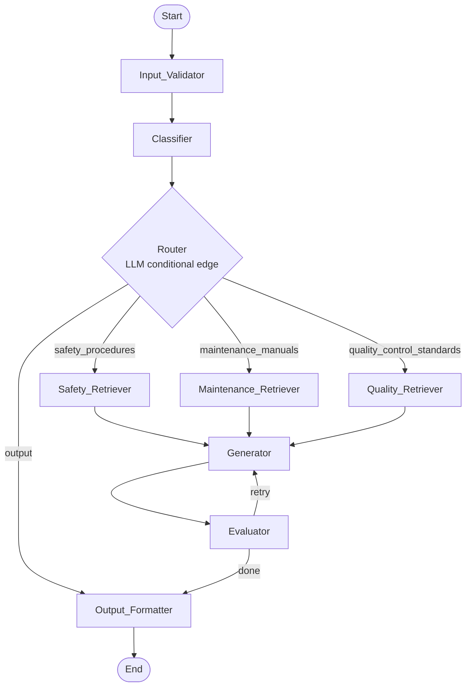
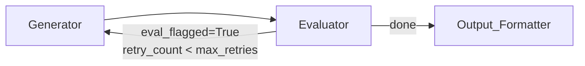
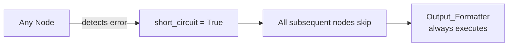

# Architecture — Agentic RAG Plant Floor Assistant

## Pipeline Overview

The system is implemented as a LangGraph `StateGraph` — a stateful directed graph where each node reads from and writes to a shared `PipelineState`. A `short_circuit` flag propagates early-exit conditions cleanly through the graph without branching every edge.



---

## Node Contracts

### Input_Validator
- Rejects empty/whitespace-only queries → sets `error`, `short_circuit = True`
- Rejects queries > 2000 characters → sets `error`, `short_circuit = True`
- Strips control characters, normalizes whitespace → stores in `validated_query`

### Classifier
- Single LLM call (temperature=0)
- Maps query to: `safety_procedures | maintenance_manuals | quality_control_standards | unknown`
- On `unknown` → sets out-of-scope message, `short_circuit = True`

### Router
- LangGraph conditional edge (independent LLM call, temperature=0)
- Decoupled from Classifier — applies its own language understanding
- Any non-match → falls back to `output_formatter`

### Retrievers (×3)
- One per domain: Safety, Maintenance, Quality Control
- Executes hybrid search: BM25 + ChromaDB cosine similarity
- Merges results via Reciprocal Rank Fusion (RRF)
- On empty results → sets no-results message, `short_circuit = True`

### Generator
- Chain-of-thought RAG prompt: `Reasoning:` / `Answer:` parsing
- Answers only from retrieved context
- Injects last `conversation_history_window` turns for multi-turn support
- Appends user/assistant turns to `conversation_history`

### Evaluator
- LLM-as-judge scoring (JSON structured output)
- Four dimensions: `answer_relevance`, `context_relevance`, `groundedness`, `completeness`
- If any score < `eval_threshold` → sets `eval_flagged = True`, triggers one retry
- After retry → always continues to Output_Formatter

### Output_Formatter
- Always executes (no short-circuit skip)
- Error path: returns `{error, reasoning_trace}`
- Success path: returns `{answer, reasoning_steps, sources, eval_scores, eval_flagged, reasoning_trace}`

---

## Hybrid Search — Reciprocal Rank Fusion

Each retriever runs two searches in parallel:
1. BM25 keyword search (rank-bm25) — handles exact term matches
2. ChromaDB vector search (cosine similarity) — handles semantic/paraphrased queries

Results are merged using RRF:

```
RRF(d) = Σ  1 / (k + rank_i(d))    where k = 60
         i=1..N
```

Top `top_k` results after fusion are passed to the Generator.

---

## Retry Loop



---

## Short-Circuit Propagation



---

## Data Flow

```
raw_query
  → validated_query        (Input_Validator)
  → category               (Classifier)
  → chunks: ChunkSource[]  (Retriever)
  → answer + cot_reasoning (Generator)
  → eval_scores            (Evaluator)
  → final_response         (Output_Formatter)
```

---

## ChromaDB Collections

| Collection | Domain | Content |
|---|---|---|
| `safety_procedures` | Safety | PPE requirements, lockout/tagout, hazard codes, emergency response |
| `maintenance_manuals` | Maintenance | Equipment procedures, maintenance intervals, torque specs, part numbers |
| `quality_control_standards` | Quality | Inspection checklists, tolerances, defect codes, sampling procedures |

Three separate collections are used (vs. one with metadata filters) to reduce retrieval latency and avoid cross-domain noise.

---

## Graph Assembly

```python
graph = StateGraph(PipelineState)

graph.add_node("input_validator", validate_input)
graph.add_node("classifier", classify_query)
graph.add_node("safety_retriever", retrieve_safety)
graph.add_node("maintenance_retriever", retrieve_maintenance)
graph.add_node("quality_retriever", retrieve_quality)
graph.add_node("generator", generate_answer)
graph.add_node("evaluator", evaluate_answer)
graph.add_node("output_formatter", format_output)

graph.set_entry_point("input_validator")
graph.add_edge("input_validator", "classifier")
graph.add_conditional_edges("classifier", route_query, {
    "safety_procedures": "safety_retriever",
    "maintenance_manuals": "maintenance_retriever",
    "quality_control_standards": "quality_retriever",
    "output": "output_formatter",
})
graph.add_edge("safety_retriever", "generator")
graph.add_edge("maintenance_retriever", "generator")
graph.add_edge("quality_retriever", "generator")
graph.add_edge("generator", "evaluator")
graph.add_conditional_edges("evaluator", _evaluator_edge, {
    "retry": "generator",
    "done": "output_formatter",
})
graph.add_edge("output_formatter", END)

pipeline = graph.compile(checkpointer=MemorySaver())
```
