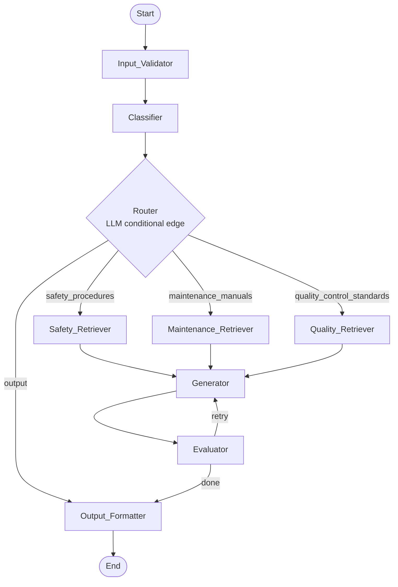

# Plant Floor RAG Assistant

An agentic Retrieval-Augmented Generation (RAG) pipeline for plant floor supervisors to ask natural language questions and get grounded, cited answers from internal documentation — safety procedures, maintenance manuals, and quality control standards.

Built with LangGraph, ChromaDB, hybrid search (BM25 + semantic), and a Streamlit UI.


App Live: https://agentic-rag-plant-floor-assistant-production.up.railway.app

---

## Architecture



The pipeline is a LangGraph `StateGraph` where each step is a node that reads from and writes to a shared `PipelineState`. A `short_circuit` flag propagates early-exit conditions cleanly through the graph without branching every edge.

### Pipeline Nodes

| Node | Responsibility |
|---|---|
| Input_Validator | Sanitizes and validates the raw query (length, control chars, whitespace) |
| Classifier | LLM call (temp=0) to categorize query into safety / maintenance / quality / unknown |
| Router | LLM conditional edge — routes to the correct retriever collection |
| Retrievers (×3) | Hybrid search: BM25 + ChromaDB cosine similarity merged via RRF |
| Generator | Chain-of-thought RAG prompt with conversation history windowing |
| Evaluator | LLM-as-judge scoring across 4 dimensions; triggers one retry if scores are low |
| Output_Formatter | Assembles final response with answer, sources, reasoning trace, and eval scores |

### Hybrid Search — Reciprocal Rank Fusion (RRF)

Each retriever runs BM25 keyword search and ChromaDB vector search in parallel, then merges both ranked lists using RRF:

```
RRF(d) = Σ  1 / (k + rank_i(d))    where k = 60
         i=1..N
```

The top `top_k` results after fusion are passed to the Generator.

### Retry Loop

When the Evaluator flags low quality (`eval_flagged = True`) and `retry_count < max_retries`, it increments the counter, clears `short_circuit`, and the graph edge returns control to the Generator for one retry. After the retry the pipeline always continues to the Output_Formatter regardless of the second result.

---

## Data Models

```python
class PipelineState(BaseModel):
    raw_query: str = ""
    validated_query: str = ""
    category: Optional[Category] = None
    chunks: list[ChunkSource] = []
    answer: str = ""
    cot_reasoning: str = ""
    conversation_history: list[dict] = []
    retry_count: int = 0
    eval_scores: Optional[EvalScores] = None
    eval_flagged: bool = False
    final_response: Optional[dict] = None
    reasoning_trace: list[str] = []
    error: Optional[str] = None
    short_circuit: bool = False

class ChunkSource(BaseModel):
    collection: str   # ChromaDB collection name
    document: str     # source PDF filename
    section: str      # section heading
    chunk_id: str     # unique chunk identifier
    content: str      # chunk text

class EvalScores(BaseModel):
    answer_relevance: float = 0.0
    context_relevance: float = 0.0
    groundedness: float = 0.0
    completeness: float = 0.0
```

---

## Tech Stack

| Layer | Technology |
|---|---|
| Pipeline orchestration | LangGraph `StateGraph` + `MemorySaver` |
| Vector store | ChromaDB (3 separate collections) |
| Keyword search | rank-bm25 (BM25Okapi) |
| LLM backend | Groq `llama-3.3-70b-versatile` (OpenAI-compatible) |
| Data validation | Pydantic v2 / pydantic-settings |
| PDF parsing | pypdf |
| Synthetic data | reportlab |
| UI | Streamlit |

---

## Project Structure

```
rag_pipeline/
  nodes/              # classifier, router, retrievers, generator, evaluator, output_formatter
  config.py           # Settings via pydantic-settings
  graph.py            # LangGraph pipeline definition
  llm.py              # LLM client factory
  state.py            # PipelineState, ChunkSource, EvalScores
scripts/
  generate_pdfs.py    # synthetic PDF generation (reportlab)
  ingest_pdfs.py      # PDF chunking + ChromaDB ingestion
  populate_db.py      # convenience: generate + ingest all collections
tests/
  unit/               # per-node unit tests with mocked LLM
  property/           # Hypothesis property-based tests (17 properties)
app.py                # Streamlit UI
```

---

## Quickstart

### 1. Install dependencies

```bash
pip install -e .
```

### 2. Set up environment

```bash
cp .env.example .env
# Add your GROQ_API_KEY to .env
```

### 3. Populate the knowledge bases

```bash
python scripts/populate_db.py
```

Generates 9 synthetic PDFs (3 per domain) and ingests them into ChromaDB.

### 4. Run the app

```bash
streamlit run app.py
```

Open http://localhost:8501

---

## Environment Variables

| Variable | Description | Default |
|---|---|---|
| `GROQ_API_KEY` | Groq API key (required) | — |
| `GROQ_MODEL` | Model name | `llama-3.3-70b-versatile` |
| `CHROMA_PERSIST_DIR` | ChromaDB storage path | `./chroma_db` |
| `TOP_K` | Chunks retrieved per query | `5` |
| `EVAL_THRESHOLD` | Min score before retry | `0.6` |
| `MAX_RETRIES` | Max generator retries | `1` |
| `CONVERSATION_HISTORY_WINDOW` | Turns of history in prompt | `5` |

---

## Sample Questions

**Safety:** "What PPE is required when working near chemical hazards?"
**Maintenance:** "How do I perform scheduled maintenance on a conveyor motor?"
**Quality:** "What are the acceptance criteria for incoming raw material inspection?"
**Follow-up:** "Can you give me more detail on that?"

---

## UI Features

- Chat interface with multi-turn conversation memory
- Reasoning steps expander (chain-of-thought trace)
- Sources table (collection, document, section, chunk_id)
- Evaluation scores panel (4 dimensions per response)
- Sidebar PDF upload — ingest new documents into any collection at runtime

---

## Testing

```bash
# Unit tests
pytest tests/unit

# Property-based tests (Hypothesis, 100 examples each)
pytest tests/property
```

17 correctness properties are verified with Hypothesis covering: input validation, short-circuit propagation, RRF merge correctness, generator prompt construction, evaluator retry logic, output formatter response shape, and conversation history windowing.

---

## Error Handling

| Condition | Node | Behavior |
|---|---|---|
| Empty / whitespace query | Input_Validator | Sets `error`, short-circuits |
| Query > 2000 chars | Input_Validator | Sets `error`, short-circuits |
| Unknown category | Classifier | Sets out-of-scope message, short-circuits |
| Invalid router response | Router | Falls back to Output_Formatter |
| No chunks found | Retriever | Sets no-results message, short-circuits |
| Low eval scores (first attempt) | Evaluator | Flags, increments retry, clears short-circuit |
| Low eval scores (after retry) | Evaluator | Flags, continues to Output_Formatter |

All error states reach the Output_Formatter, which always produces a well-formed `final_response` dict.
